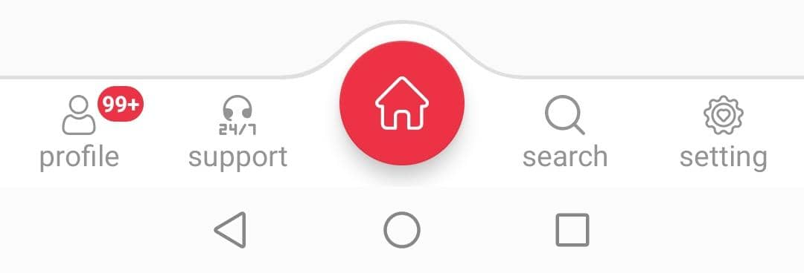

# BottomNavigation

[](https://jitpack.io/#Hofinity/BottomNavigation)

<p align="center">

</p>

<p align="center">

</p>


### Gradle ###

Step 1. Add it in your root build.gradle at the end of repositories:

```groovy
	allprojects {
		repositories {
			...
			maven { url 'https://jitpack.io' }
		}
	}
  
  ```
  
  Step 2. Add the dependency
  
  ```groovy

	dependencies {
	        implementation 'com.github.Hofinity:BottomNavigation:0.0.2'
	}
	
   ```	
  -------------------------------------------------------------------------
  
  ### Maven ###
  
  Step 1. 
  
```groovy
  	<repositories>
		<repository>
		    <id>jitpack.io</id>
		    <url>https://jitpack.io</url>
		</repository>
	</repositories>
```
  
  Step 2. Add the dependency

```groovy
	<dependency>
	    <groupId>com.github.Hofinity</groupId>
	    <artifactId>BottomNavigation</artifactId>
	    <version>0.0.2</version>
	</dependency>
```
  -------------------------------------------------------------------------


# Getting started

  Adding a custom widget in `xml` :

  ```xml
  <com.hofinity.bottomNavigation.BottomNavigationView
        android:id="@+id/bnv"
        android:layout_width="match_parent"
        android:layout_height="75dp"
        android:layout_gravity="bottom"
        app:bm_activeItemColor="#ed3245"
        android:background="#ffffff"
        app:bm_inactiveCenterButtonBackgroundColor="#ffffff"
        app:bm_inactiveItemColor="#949494"
        app:bm_backgroundColor="#ffffff"
        app:bm_activeCenterButtonBackgroundColor="#ed3245"
        app:bm_inactiveCenterButtonIconColor="@color/black"
        app:bm_centerButtonIcon="@drawable/ic_home"
        android:layout_alignParentBottom="true"
        app:bm_itemIconSize="18dp"
        app:bm_itemIconOnlySize="25dp"
        app:bm_itemTextSize="13dp"
        app:bm_itemsMode="normal"
        app:bm_show_border="true"
        app:bm_border_color="#dfdfdf"
        app:bm_badgeBackgroundColor="#ed3245"
        app:bm_badgeTextColor="#ffffff"
        app:bm_badgeShapeType="filledOval"
        app:bm_borderType="centerCurved"/>
  ```

  Binding view in `Activity`:
  ```java
      BottomNavigationView bnv = findViewById(R.id.bnv);
   ```
	
  Add items:
  ```java
        bnv.addBmItem(new BmItem("profile", R.drawable.ic_user));
        bnv.addBmItem(new BmItem("support", R.drawable.ic_support));
        bnv.addBmItem(new BmItem("search", R.drawable.ic_search));
        bnv.addBmItem(new BmItem("setting", R.drawable.ic_settings));

  ```
  Add badge view:
  
  ```java
        bnv.showBadgeAtIndex(0,1000);
        bnv.showFullBadgeText(true);
  ```
	
  Items click listener:
```java
        bnv.setBmOnClickListener(new BmOnClickListener() {
            @Override
            public void onCenterButtonClick() {

            }

            @Override
            public void onItemClick(int itemIndex, String itemTitle) {
                
            }

            @Override
            public void onItemReselected(int itemIndex, String itemTitle) {

            }

        });
	
  ```
	
  Items long click listener:
```java
        bnv.setBmOnLongClickListener(new BmOnLongClickListener() {
            @Override
            public void onCenterButtonLongClick() {

            }

            @Override
            public void onItemLongClick(int index, String title) {

            }
        });
  ```
